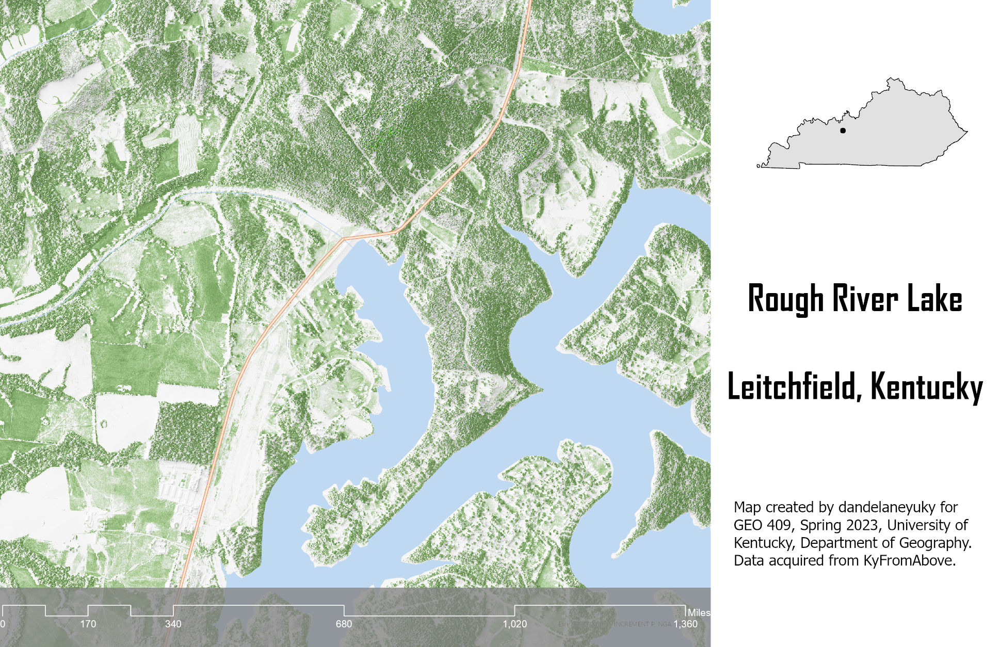

# Custom Shaded Relief Map
# Rough River Lake
## Leitchfield, Kentucky

The lake is situated in Breckinridge, Hardin, and Grayson counties in south central Kentucky. The dam is located on the Rough River, about 20 miles from Leitchfield and 90 miles from Louisville

     
*Custom Shaded Relief Map*

[Link to high-resolution version](hi-res.pdf)     

Map created by dandelaneyuky for GEO 409, Spring 2023, University of Kentucky, Department of Geography. Data acquired from KyFromAbove.